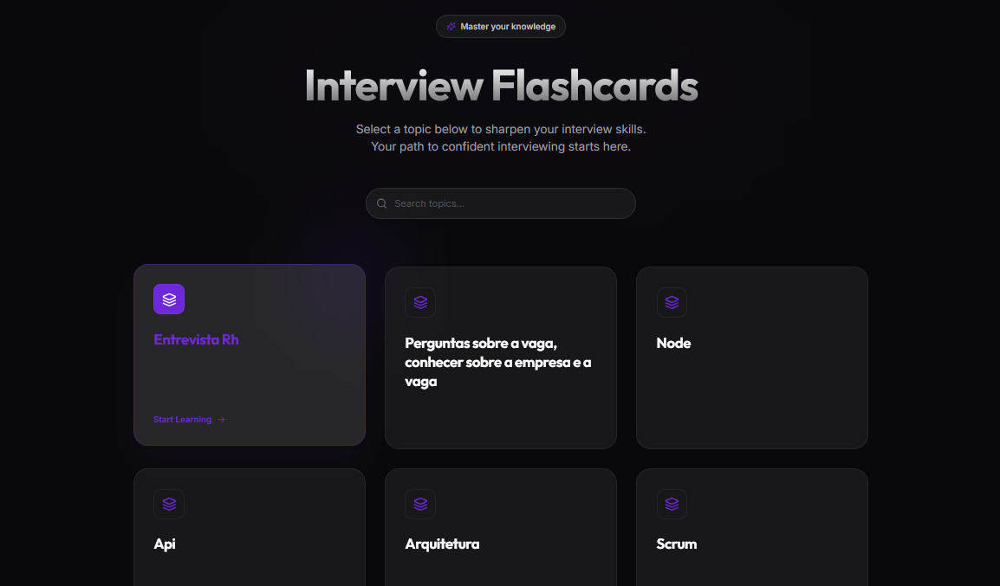
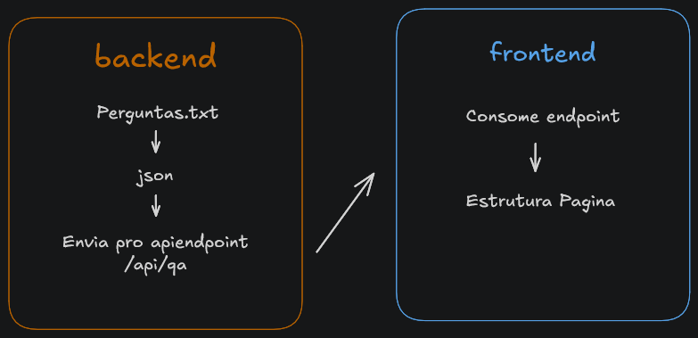

## Interview Flashcards

Uma aplicação de flashcards para treino de entrevistas, com perguntas na frente e respostas no verso. Simples, personalizável e escalável, ideal para memorizar conteúdos e praticar respostas.



---

### ✨ Funcionalidades

- **Listagem de categorias de estudo** (ex.: temas de entrevistas)
- **Busca por categorias** no frontend (campo de search filtrando em tempo real)
- **Cards com Perguntas e Respostas** esta com as respostas na ponta da lingua para entrevistas.
- **Interface moderna e animada** (Framer Motion, ícones Lucide, design responsivo)

---

### ⚙️ Funcionamento

O projeto tem como objetivo ser simples, direto e fácil de manter.
****
Para adicionar novas perguntas e respostas, basta editar o arquivo de texto localizado em:

```
backend/src/main/resources/perguntas.txt
```

A estrutura é:

\# -> Topico
? -> Pergunta
\> -> Resposta

Exemplo:

```
#Entrevista Rh
?Qual seu maior defeito?
>Perfeccionismo
```

---

### 🧱 Arquitetura

- **Backend**
  - Springboot
  - Spring Web
  - Jackson
  - DevTools

- **Frontend**
  - Vite
  - React
  - Tailwind, Animate e Merge
  - Radix-ui
  - Clsx
  - Cmdk
  - Framer-motion
  - Lucide-react
  - Axios

- **Docker Compose**
  - Serviço `backend`:
    - `build: ./backend`
    - `ports: "8080:8080"`
  - Serviço `frontend`:
    - `build: ./frontend`
    - `ports: "5173:5173"`
    - `environment: VITE_API_URL=http://localhost:8080`
    - `depends_on: backend`
  - Rede `app-network` do tipo `bridge`

---

### 🚀 Como rodar o Projeto

#### Docker (recomendado)

**Pré-requisitos:**

- **Docker** e **Docker Compose** instalados.

**Passos:**

Na raiz do projeto (onde está o `docker-compose.yml`):

```bash
docker compose up --build
```

O backend ficará acessível em: `http://localhost:8080`  
O frontend ficará acessível em: `http://localhost:5173`

Para parar:

```bash
docker compose down
```

### 🧑‍💻 Rodando sem Docker (desenvolvimento local)

#### Backend

**Pré-requisitos:**

- Java 21 (ou compatível)
- Maven 3.9+

**Passos (na pasta `backend`):**

```bash
# Instalar dependências e gerar jar
mvn clean package

# Rodar aplicação
java -jar target/*.jar

# Ou Rodar usando Maven
mvn spring-boot:run
```

O backend ficará em `http://localhost:8080`.

#### Frontend

**Pré-requisitos:**

- Node.js 20+
- pnpm instalado globalmente (`npm install -g pnpm`)

**Passos (na pasta `frontend`):**

```bash
# Instalar dependências
pnpm install

# Rodar em modo desenvolvimento
pnpm dev
```

Por padrão, o Vite roda em `http://localhost:5173`.

---

Certifique-se de que o arquivo `frontend/.env` aponte para o backend:

```env
VITE_API_URL=http://localhost:8080
```

---

### 📂 Estrutura (resumo)

```text
Interview-Flashcards/
  backend/
    dockerfile
    pom.xml
    src/
      ...
  frontend/
    dockerfile
    .env
    .dockerignore
    client/
      src/
        pages/
          Home.tsx
        services/
          api.ts
        components/
          CategoryCard.tsx
        ...
  docker-compose.yml
```

---

### 🔗 Endpoints principais (backend)

- `GET /api/qa`

Retorna um objeto no formato:

```json
{
  "Categoria 1": [
    { "pergunta": "Pergunta A", "resposta": "Resposta A" },
    { "pergunta": "Pergunta B", "resposta": "Resposta B" }
  ],
  "Categoria 2": [{ "pergunta": "Pergunta X", "resposta": "Resposta X" }]
}
```

O frontend converte as chaves do objeto em categorias e exibe os flashcards correspondentes.



---

### 📌 Próximos passos / ideias

- Criação/edição de flashcards pelo usuário direto pelo frontend
- Marcador de acertos
- Ferramenta de memorização estilo Anki
